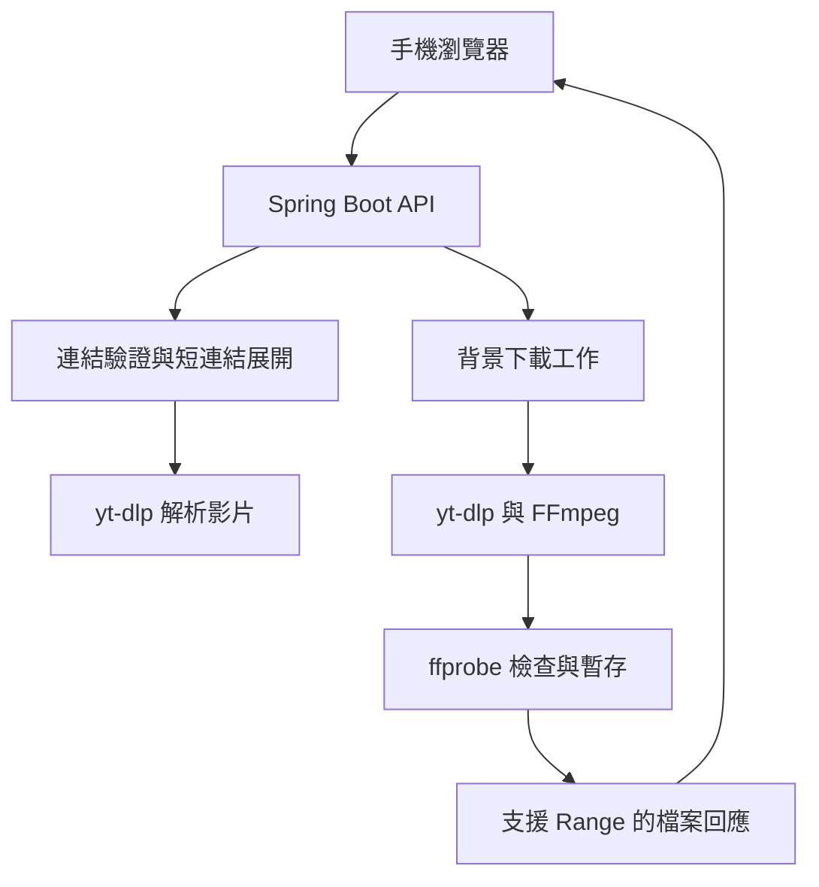

# ClipPocket — 手機版 Facebook 影片下載工具

V-Get 的獨立網頁版，介面名稱為 ClipPocket。完整的手機版 HTML／CSS／JavaScript 前端與 Spring Boot 後端。前端由同一個 Spring Boot 服務提供，不需額外架設 Node.js、Nginx 或資料庫。

## 啟動

已安裝 Docker 與 Docker Compose 時，從儲存庫根目錄執行：

```bash
cd web
docker compose up --build -d
```

電腦開啟 <http://localhost:8080>。首次建置會下載 Maven 依賴、Java 映像檔、yt-dlp 與 FFmpeg，需要可連外的網路。

若要用同一 Wi-Fi 的手機操作：將 `.env.example` 複製為 `.env`，把 `HOST_BIND` 改成 `0.0.0.0`，重新執行上面的指令，再用手機開啟 `http://電腦的區域網路IP:8080`。電腦防火牆需允許該連接埠。手機透過 HTTP 存取時，「貼上」按鈕可能無法讀取剪貼簿，可改用長按欄位 → 貼上。

預設只綁定 `127.0.0.1`，適合個人使用。信任的區域網路可自行開放；本專案未提供使用者登入，工作階段隔離不等於身分驗證。

## 操作流程

1. 在 Facebook 的影片分享選單複製連結。
2. 貼到網頁並按「解析影片」。分享短連結會先嘗試展開為影片網址。
3. 選擇來源提供的畫質，按「準備下載」。
4. 後端下載影片，必要時合併影像與聲音；完成後可預覽。
5. 按「儲存影片」，到瀏覽器的下載項目確認。

公開影片也可能因 Facebook 的登入要求、機房 IP 限制、地區限制或改版而解析失敗。本工具不接收 Facebook 帳密／Cookie，也不繞過登入、付費或其他存取權限。直播中內容與播放清單不支援。

## 技術與架構

| 元件 | 實作 |
| --- | --- |
| 前端 | 原生 HTML、CSS、JavaScript；繁體中文、手機單欄介面 |
| 後端 | Java 17、Spring Boot 3.5.16、Spring MVC、Bean Validation |
| 影片解析 | yt-dlp 2026.8.19；限定 Facebook extractors |
| 短連結 | Java HttpClient；不自動轉址，每一跳重新驗證 |
| 影片處理 | FFmpeg 合併、ffprobe 檢查影像與音訊 |
| 背景工作 | 2 個下載工作執行緒、有限佇列、可取消 |
| 暫存 | 記憶體內工作資訊＋容器 `/tmp` 暫存檔 |
| 存取範圍 | 同一個瀏覽器工作階段才能查看／下載自己的工作 |
| 測試 | JUnit 5、Mockito、MockMvc |



`VideoService` 保留原始影片網址與伺服器取得的格式選擇器；前端只提交 `videoId` 與 `formatId`。前端不能指定遠端下載網址、檔案路徑或任意 yt-dlp 選項。

## API

| Method | 路徑 | 用途 |
| --- | --- | --- |
| GET | `/api/health` | 應用程式存活檢查；不代表 Facebook 可存取 |
| POST | `/api/videos/inspect` | 解析影片並建立目前工作階段的影片資訊 |
| POST | `/api/jobs` | 建立背景下載工作，回傳 HTTP 202 |
| GET | `/api/jobs/{id}` | 查詢工作狀態 |
| DELETE | `/api/jobs/{id}` | 取消工作並移除暫存；已完成工作也可刪除 |
| GET | `/api/jobs/{id}/file` | 下載完成的影片，支援 HTTP Range |
| GET | `/api/jobs/{id}/file?inline=true` | 同一支影片的瀏覽器播放回應 |

解析：

```json
{"url":"https://www.facebook.com/reel/123456789/"}
```

上面是格式示意，不是可驗證的真實影片。

回傳欄位：`id`、`title`、`uploader`、`duration`、`sourceUrl`、`expiresAt` 與 `formats`。每個格式包含 `id`、`label`、`detail`。

建立工作：

```json
{"videoId":"從解析回應取得的 id","formatId":"從 formats 取得的 id"}
```

工作狀態：`QUEUED` → `RUNNING` → `READY`；也可能成為 `FAILED` 或 `CANCELLED`。只有 `READY` 才回傳檔案與預覽路徑。相同工作階段重複提交相同影片與畫質時，會重用仍有效的工作。

API 依賴 HttpOnly 的 `JSESSIONID`。使用 curl 或其他 API client 時，必須在請求間保留同一組 Cookie。前端使用同源請求，沒有開放跨來源 CORS。

錯誤回應統一為：

```json
{"code":"VIDEO_UNAVAILABLE","message":"無法取得影片。可能需要登入、來源限制存取、網址已失效，或影片格式已變更。"}
```

400：網址／格式錯誤；404：工作不存在、已過期或不屬於目前工作階段；409：檔案尚未完成；413：請求過大；422：影片無法處理；429：超出工作或解析額度；503：解析程式無法啟動；504：解析／下載逾時。

## 預設限制

| 項目 | 預設值 |
| --- | --- |
| 單支影片 | 最長 30 分鐘、完成檔最大 250 MiB |
| 原始素材與合併暫存 | 每個工作最多約 750 MiB，處理時持續檢查 |
| 分享短連結 | 最多 4 跳，每次 HTTP 請求逾時 8 秒，總時間另設上限 |
| 影片資訊解析 | 40 秒 |
| 影片下載與合併 | 5 分鐘；ffprobe 檢查另限 15 秒 |
| 影片資訊有效期 | 10 分鐘 |
| 完成檔有效期 | 完成後 30 分鐘 |
| 下載佇列 | 同時 2 個執行、最多 4 個等待 |
| 解析併發 | 同時 1 個 |
| 保存的工作總數 | 最多 8 個，包括尚未清理的終止工作 |
| 每個工作階段 | 最多 3 個工作、每分鐘最多 10 次解析請求 |
| 請求內容 | 8 KiB；網址最多 2,048 字元 |
| 容器暫存 | 1.5 GiB tmpfs；總記憶體上限 3 GiB |

限制集中在 `application.yml`。若改變時長、大小或保留時間，也請同步調整前端使用說明。定時清理每 60 秒執行；故檔案實際刪除時間可能比有效期晚至多約 60 秒，但 API 在有效期結束後即拒絕存取。重啟容器會清除工作與影片，沒有資料庫。

未知大小的影片會在下載途中以磁碟用量檢查，可能短暫超過單工作檢查值；容器 tmpfs 提供最終容量界線。影片準備採不定長度進度條，不會捏造百分比。停止等待解析只中止瀏覽器等候，已開始的伺服器解析仍會在既定逾時內結束；取消下載工作則會中止子程序並清理。

## 維護與部署

Docker 以多階段建置執行 `mvn verify`，測試失敗就不產生映像檔。執行階段使用非 root 使用者、唯讀根目錄及暫存容量限制。`ProcessBuilder` 以參數陣列啟動程序，不經過 shell；只有伺服器產生的檔案名稱與格式選擇器能傳入程序。

若 Facebook 改版導致無法解析，調整 `.env` 的 `YT_DLP_VERSION`，並執行 `docker compose build --no-cache` 後重啟。FFmpeg 由 Ubuntu 套件庫安裝；映像檔與 apt 的修補版本未以 digest 鎖定，可依正式環境供應鏈規範另行固定。

若部署在 HTTPS 反向代理後方，設定 `PUBLIC_ORIGIN=https://你的網域` 與 `COOKIE_SECURE=true`。本程式不信任任意 `Forwarded` 或 `X-Forwarded-*` 標頭，也不開放跨來源 API。正式對外服務應由部署環境提供使用者登入、入口限流與出口網路控制。

**網路邊界：**已限制初始 Facebook 網址，且自行展開短連結時驗證每個轉址和公開 IP。yt-dlp／FFmpeg 本身仍會存取 Facebook 回傳的 CDN、manifest 與後續轉址；這不是完整的 SSRF 出口沙箱。對外部署時，需在網路層拒絕內部網段、雲端 metadata 與其他受保護位址。不要將本服務設定為可任意存取內網的公開下載代理。

## 不用 Docker

安裝 Java 17、Maven 3.6.3 以上、Python 3.10 以上、yt-dlp、FFmpeg／ffprobe後，在 `web/` 目錄執行：

```bash
python -m pip install yt-dlp==2026.8.19
mvn verify
java -jar target/clippocket-1.0.0.jar
```

如 `yt-dlp` 不在 PATH，可設定環境變數 `YT_DLP_BIN` 指向執行檔。Java 版本不需高於 17。自行修改程式後，以 Maven 3.6.3 以上執行：

```bash
mvn verify
java -jar target/clippocket-1.0.0.jar
```

`ProcessRunnerTest` 使用 `/bin/sleep` 與 `/usr/bin/printf`，因此目前測試執行環境為 Linux；Windows 可透過 Docker 或 WSL 建置。Mockito 使用 subclass mock maker，無需動態掛載 Java agent。

## 驗證狀態

- `mvn verify` 通過：31 項測試、0 失敗、0 錯誤。
- 透過 MockMvc 驗證解析 → 建立工作 → READY → Range 下載 → 取消；外部解析器以測試替身隔離。
- 驗證工作階段隔離、跨來源請求拒絕、請求大小限制、惡意網址與轉址拒絕、程序逾時與取消，以及格式篩選。
- JavaScript 語法、前端 URL／API 契約、HTML 元件參照與本機資源均已檢查。
- 已成功建置可執行 JAR；編譯產物不提交至 Git，請透過 `mvn verify` 或 Docker 建置。
- 未執行 Docker 映像檔建置：本次環境沒有 Docker。
- 對 yt-dlp 官方 Facebook 測試影片嘗試實際解析時遭遇網路逾時，因此**未完成真實 Facebook 影片下載驗證**。
- 未執行瀏覽器視覺測試。WebMCP 採功能偵測註冊，當前環境未提供可用的 WebMCP 驗證內容；不影響一般操作。

網頁版的 `src/main/resources/static/config.js` 設為 `previewOnly: false`，會呼叫同一個 Spring Boot 服務的 API。若只需展示介面，可改為 `true`，顯示明確標示的示範資料；示範模式不會下載影片。

## 官方參考

- [Spring Boot 3.5 系統需求](https://docs.spring.io/spring-boot/3.5/system-requirements.html)
- [yt-dlp 專案與使用說明](https://github.com/yt-dlp/yt-dlp)
- [yt-dlp 2026.8.19](https://pypi.org/project/yt-dlp/2026.8.19/)
- [FFmpeg／ffprobe 文件](https://ffmpeg.org/ffprobe.html)
